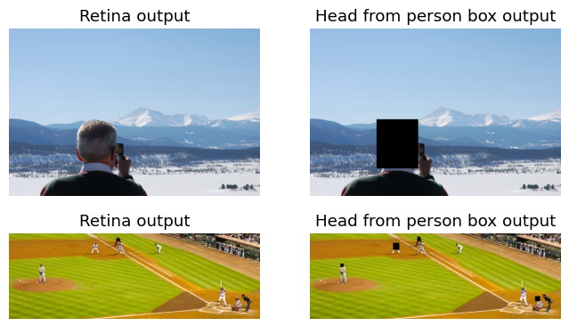
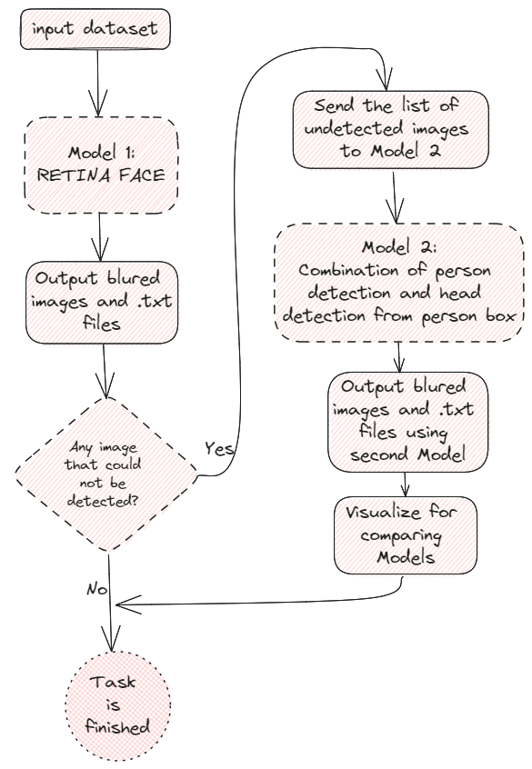
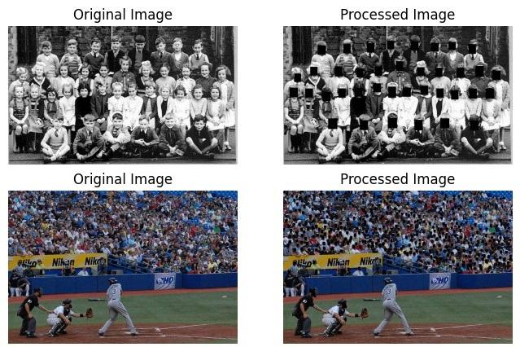

# Producing Head Labels in YOLO.txt Format

This project aims to reduce manual work for labelers by automatically generating head labels in YOLO.txt format. The final product allows users to detect and label heads in images efficiently. The pipeline utilizes two separate models to achieve accurate head detection and handle challenging scenarios.

## Getting Started

Follow these steps to use the project:

1. Clone the repo and Open the `final.ipynb` file in a Jupyter Notebook environment.
2. Optionally, create a new work environment for the project.
3. Install the required dependencies by running the first cell in the notebook. (This will take a while)
4. Run the second cell and input the desired variables.
5. Click "RUN!" to start the head detection process.
(The first run might take longer due to downloading dependencies)

The code generates .txt files with the same name as each image, containing the head labels in YOLO.txt format:

<class_index> <x_center> <y_center> <width> <height>

All coordinates are normalized by image width and height, ranging from 0 to 1.

Additionally, the Jupyter Notebook provides a preview of the detected heads, allowing users to verify the quality of the detections while the model processes the images.

## Pipeline Overview

To maximize performance and detect as many heads as possible, the pipeline employs two separate models:

### 1. Retina Face Model

Initially, the project utilizes the [RETINA face model](https://github.com/serengil/retinaface) for face detection. Although the RETINA model has good accuracy for faces, it may miss images where the face is not clear, such as people shown from the back or wearing personal protective equipment (PPE) from different angles. This step serves as a quick solution to detect faces and produce YOLO.txt files.

- Speed: approximately 2.45 seconds per image.
- Accuracy: Good, but may fail to detect certain images.

### 2. YOLO Head Detector Model

To improve accuracy and handle challenging scenarios, a second method is used. The pipeline proceeds as follows:

- The image is first fed to a pretrained YOLO model to detect a person.
- The detected person's bounding box is then used as input to another pretrained YOLO model to detect the head.

This approach performs well in detecting heads from various angles and complements the limitations of the RETINA model.

- Speed: approximately 2.25 seconds per image.
- Accuracy: Good for detecting heads from angles that the RETINA model might miss.

## Running the Project

The main file to run the project is `Final.ipynb`, but you can also execute it from `Mixed_pipline.py` and `Mixed_pipline.ipynb`. Feel free to explore and modify the codes in these files.

### Advanced Usage

If you want to use this script directly on your dataset with preexisting YOLO-style labels (i.e., you want to add head labels to your existing labels), follow these steps:

1. Backup your dataset before proceeding.
2. In the script, set the output path to be the same as the input path.
3. Set Visualization to False.
4. Find this line in the code: `with open(txt_output_path, 'w') as f:` and change `'w'` to `'a'` (append mode instead of write mode). It should be like: `with open(txt_output_path, 'a') as f:`.

Note: This will work flawlessly if your preexisting txt files have `\n` at the end.

Thank you for using this repo! If you have any questions or feedback, feel free to reach out to the author.

Happy detecting and blurring!
